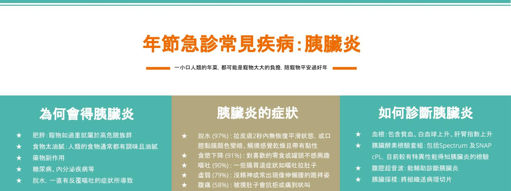

## 2022-01-24

### 陪寵物平安過年，了解年節急診常見疾病：胰臟炎

一年一度的春節即將到來，伊甸動物醫院先在這邊預祝大家新年快樂，虎年行大運！

過年免不了佛跳牆、糖醋魚、滷豬腳等豐盛的年夜飯，而在我們大快朵頤的同時，身旁毛小孩水汪汪的大眼睛配上渴求美食的眼神，你/妳，抵擋得了嗎？要小心一時的心軟，餵食了過度調味或油膩的食物，讓胰臟炎悄悄地找上無辜的毛孩喔！

胰臟炎顧名思義就是胰臟發炎了！胰臟主要是分泌消化酵素的器官，通常分泌出來的酵素，會至腸道後才開始發揮作用，當太多消化酵素在胰臟開始作用，就會出現胰臟被自己所分泌出來的酵素消化，且周邊脂肪也被分解，造成發炎，根據不同的白血球浸潤、病程長短以及胰臟有無不可逆的型態改變，又分為「急性」與「慢性」胰臟炎。

以下為大家簡單介紹 ”犬隻胰臟炎”的成因、症狀與診斷，所有品種、年齡和性別的犬隻皆可能得到胰臟炎，嚴重程度因個體而異，如果家中有狗兒子/女兒的家長們要特別注意喔！

#### 如果真的得了胰臟炎怎麼辦？
胰臟炎沒有特效藥，我們能給予的多為支持及對症治療，因此也會因為每隻患犬嚴重程度的不同，而給予不同的治療計畫。常見的治療包括輸液療法、制酸止吐、止痛及營養支持，若嚴重胰臟炎合併其他疾病感染，也可能給予抗生素治療。

雖然還是有些許因胰臟炎致死的病例，不過大多生病的毛孩在配合獸醫師的治療下還是能治癒的，因此家長們也不用過於擔心！

🔔最後來個溫馨小叮嚀🔔

過年期間親戚、鄰居、好朋友來家中拜訪之餘，也要特別注意別人與家中毛小孩互動時有沒有餵食一些毛孩不該吃的食物喔，如果想幫毛小孩加菜，水煮雞胸肉或水煮蛋就很營養豐盛。若觀察到任何家中毛孩的異樣，伊甸動物醫院過年期間不打烊！24小時全天犬貓急診陪你一起守護毛孩的健康～

參考資料:
Cridge, H., Twedt, D.C., Marolf, A.J., Sharkey, L.C., Steiner, J.M., 2021. Advances in the diagnosis of acute pancreatitis in dogs. Journal of Veterinary Internal Medicine 35, 2572-2587.
Whiteman, S., 2020. Acute canine pancreatitis–diagnosis and treatment. Veterinary Nursing Journal 35, 318-321.
Nelson, R.W., Couto, C.G., 2019. Small Animal Internal Medicine-E-Book. Elsevier Health Sciences.
